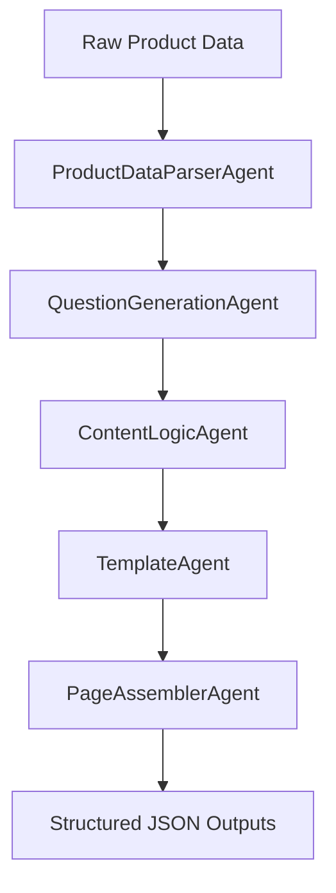

# Kasparro – Multi-Agent Content Generation System

This repository contains a **modular, agentic content generation system** built as part of the **Kasparro Applied AI Engineer assignment**. 

The system demonstrates how structured product data can be transformed into multiple **machine-readable content pages** using clear agent boundaries, reusable logic blocks, declarative templates, and explicit orchestration.

---

## 🚀 What This Project Does

Given a structured product dataset, the system automatically generates:

- **FAQ Page** (`faq.json`)
- **Product Page** (`product_page.json`)
- **Comparison Page** (`comparison_page.json`)

All outputs are:
- **Deterministic**: Consistent results based on input.
- **Rule-based**: Adheres to specific content logic.
- **Machine-readable**: Standardized JSON format.
- **Orchestrated**: Driven by specialized agents rather than a monolithic script.

---

## 🧠 System Architecture

The high-level execution flow follows a linear pipeline where data is enriched and structured at each stage:




Each agent has a **single responsibility**, ensuring clarity, extensibility, and ease of debugging.

---

## 📁 Repository Structure

```text
.
├── agents/
│   ├── parser_agent.py
│   ├── question_agent.py
│   ├── logic_agent.py
│   ├── template_agent.py
│   └── assembler_agent.py
│
├── logic_blocks/
│   ├── overview.py
│   ├── benefits.py
│   ├── usage.py
│   ├── safety.py
│   ├── pricing.py
│   ├── faq.py
│   └── comparison.py
│
├── templates/
│   ├── faq_template.json
│   ├── product_template.json
│   └── comparison_template.json
│
├── data/
│   ├── product_input.json
│   └── fictional_product_b.json
│
├── output/
│   ├── faq.json
│   ├── product_page.json
│   └── comparison_page.json
│
├── docs/
│   └── projectdocumentation.md
│
├── main.py
└── README.md

```

---

## ▶️ How to Run

### Prerequisites

* Python 3.10 or higher

### Run the system

```bash
python main.py

```

### Output

Generated files will appear in the `output/` directory:

* `faq.json`
* `product_page.json`
* `comparison_page.json`

---

## 🧩 Design Principles

* **Agent-based orchestration**: Complex tasks are broken down into manageable sub-tasks.
* **Reusable, stateless logic blocks**: Logic is modular and can be shared across different templates.
* **Declarative template definitions**: Separation of content structure from the data filling it.
* **Clear separation of concerns**: Data parsing, logic application, and formatting are decoupled.
* **Deterministic outputs**: Strictly derived from input data for reliability.

The system is intentionally designed to mirror **production-grade AI content pipelines** rather than simple prompt-based scripting.

---

## 📄 Documentation

Detailed system design, architecture, and engineering reasoning are documented in:
`docs/projectdocumentation.md`

---

## ⚠️ Notes & Constraints

* No external data or real-time research is performed.
* Comparison products are fictional and provided within the structured input.
* This project focuses on **system design and automation**, not frontend UI rendering.

---

## ✅ Conclusion

This project demonstrates a clean, extensible approach to building **agentic content systems**, emphasizing correctness, modularity, and maintainability—key qualities for production-level Applied AI Engineering.