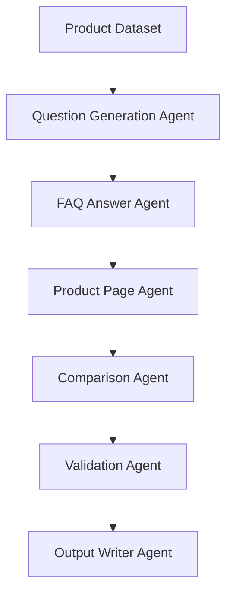

This is a significant improvement. By pivoting to a **LangGraph-orchestrated, schema-validated agentic system**, you've moved from a "script" mindset to a "distributed systems" mindset. This alignment with Kasparro’s requirements—specifically the shift from deterministic logic blocks to LLM-backed agents bounded by Pydantic schemas—is exactly what an evaluator in this space is looking for.

Here is the clean Markdown code for your updated `docs/projectdocumentation.md`.

```markdown
# Project Documentation – Multi-Agent Content Generation System

---

## 1. Problem Statement

Modern content automation systems must reliably transform structured product data into multiple downstream content formats while remaining modular, extensible, and verifiable. Traditional approaches that rely on monolithic scripts or single-prompt LLM calls suffer from poor maintainability, weak guarantees on output structure, and limited system-level reasoning.

The objective of this project is to design and implement a **production-style agentic automation system** that converts a small, fixed product dataset into multiple **machine-readable JSON content pages**, using clear agent boundaries, explicit orchestration, schema validation, and LLM-driven reasoning.

This project evaluates **system design and automation engineering**, not content writing or domain expertise.

---

## 2. Solution Overview

The system is implemented as a **LangGraph-based multi-agent pipeline**. Each agent is responsible for a single transformation step and communicates exclusively through a shared, typed graph state.

Rather than using deterministic rules or template-driven text generation, all content is produced by **LLM-backed agents**, with **Pydantic schemas acting as structural templates and validation gates**.

### High-Level Flow



---

## 3. Scope & Assumptions

### Scope

* **Input:** A single structured product dataset (GlowBoost Vitamin C Serum).
* **Output:** Three machine-readable JSON pages:
* FAQ Page
* Product Description Page
* Comparison Page (vs fictional Product B)


* **Execution:** Fully autonomous via an agent orchestration graph.

### Assumptions

* No external knowledge or web research is permitted.
* All outputs must be traceable back to the input dataset.
* The system is designed for backend automation pipelines, not UI rendering.

---

## 4. System Design (Core Architecture)

### 4.1 Agent Responsibilities

Each agent operates as a node in the LangGraph execution graph, with clearly defined inputs and outputs.

| Agent | Responsibility |
| --- | --- |
| **QuestionGenerationAgent** | Uses an LLM to generate 15+ categorized user questions from product data. |
| **FAQAgent** | Answers all generated questions using LLM reasoning grounded strictly in product data. |
| **ProductPageAgent** | Generates a structured product page (overview, benefits, usage, safety, pricing). |
| **ComparisonAgent** | Produces a structured comparison between Product A and a fictional Product B. |
| **ValidationAgent** | Enforces schema correctness and minimum content constraints (e.g., FAQ count). |
| **OutputAgent** | Persists validated JSON pages to disk. |

All agents communicate via a shared `GraphState` and do not rely on global variables or side effects.

### 4.2 Orchestration & Control Flow

The system is orchestrated using **LangGraph**, which provides:

* Explicit DAG-style execution
* Deterministic control flow
* Clear dependency ordering
* Retry handling for transient failures

Retry logic is applied to LLM-backed agents to handle non-deterministic failures while preserving system stability.

### 4.3 Templates via Schema Enforcement

Instead of traditional string-based templates, this system uses **Pydantic schemas** as declarative templates. Schemas define:

* Required fields
* Expected data types
* Structural constraints
* Validation rules

This approach ensures that all generated content is machine-readable, structurally consistent, and validated before persistence.

### 4.4 Validation & Robustness

The system includes multiple quality gates:

* Schema validation for all generated pages.
* Minimum FAQ count enforcement (≥ 15).
* Type normalization and list enforcement.
* Retry logic for LLM calls.
* Automated tests validating pipeline outputs.

---

## 5. Data & Output Structure

Each output page is emitted as clean JSON:

* `faq.json`: List of question-answer pairs (≥15).
* `product_page.json`: Structured product description.
* `comparison_page.json`: Side-by-side product comparison.

---

## 6. Extensibility

The system is designed for easy extension:

1. **New Products:** Swap input data without changing agent logic.
2. **New Page Types:** Add a new agent + schema.
3. **New Validation Rules:** Extend the validation agent.
4. **New Tools:** Agents can be augmented with external tools without altering orchestration.

---

## 7. Conclusion

This project demonstrates a production-oriented approach to building agentic automation systems. By combining LLM-backed agents, explicit orchestration, schema-based templates, and robust validation, the system avoids the pitfalls of monolithic or prompt-only solutions.
