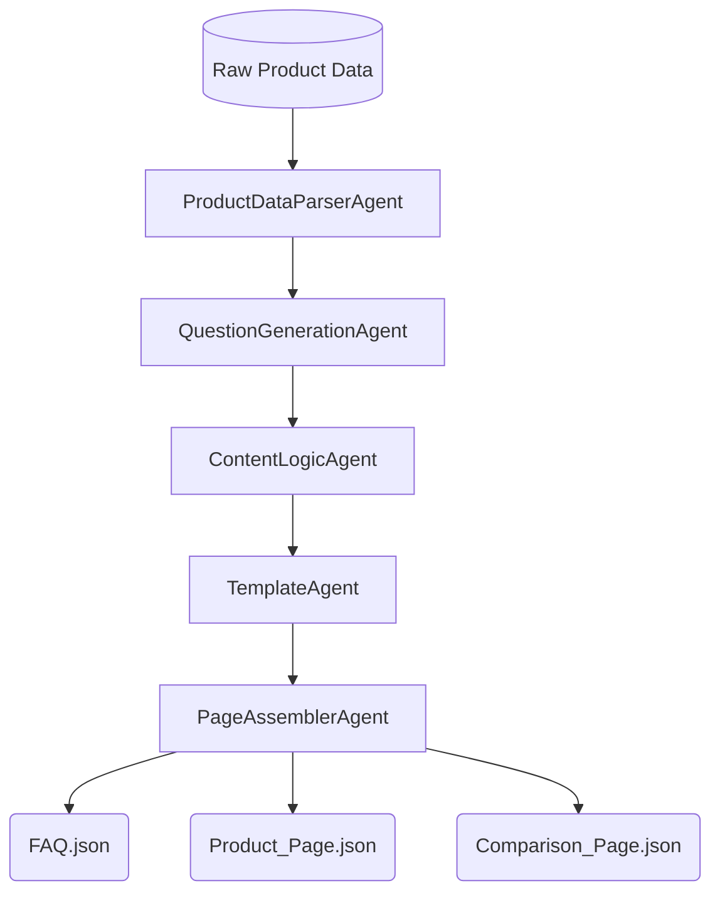

# Project Documentation – Multi-Agent Content Generation System

---

## 1. Problem Statement

Modern content systems require generating structured, consistent, and machine-readable content from raw product data at scale. Traditional approaches rely on tightly coupled scripts or prompt-based generation, which makes systems difficult to maintain, extend, or reason about.

The goal of this project is to design and implement a **modular, agentic content generation system** that transforms structured product data into multiple content pages using **clear agent boundaries**, **reusable logic blocks**, and **template-driven assembly**.

---

## 2. Solution Overview

This system implements an **agent-orchestrated pipeline** that converts raw product data into structured JSON pages. It cleanly separates data parsing, content logic, template structure, and output assembly.

### High-level Flow

---

## 3. Scope & Assumptions

### Scope

* **Input**: Limited to the provided product dataset.
* **Format**: All outputs are strictly machine-readable JSON.
* **Deliverables**: Three distinct pages (FAQ, Product, and Comparison).

### Assumptions

* **Data Privacy**: No external data or web research is used.
* **Integrity**: Outputs are deterministic and rule-based.
* **Purpose**: Designed for system automation and extensibility, not UI/frontend rendering.

---

## 4. System Design (Core Architecture)

### 4.1 Agent Responsibilities

| Agent | Responsibility |
| --- | --- |
| **ProductDataParserAgent** | Normalizes raw input into a consistent internal data model. |
| **QuestionGenerationAgent** | Generates categorized questions (Safety, Usage, etc.) without page awareness. |
| **ContentLogicAgent** | Executes domain-agnostic transformations (Overview, Benefits, Pricing). |
| **TemplateAgent** | Applies declarative schemas and validates required content blocks. |
| **PageAssemblerAgent** | Finalizes the JSON structure and handles file persistence. |

---

### 4.2 Logic Blocks

Logic blocks are **pure, reusable functions** that accept structured input and return deterministic output. They are stateless and have no knowledge of the final page layout.

* *Examples*: `generate_benefits_block`, `pricing_categorization`, `compare_products_block`.

### 4.3 Template Engine

Templates are declarative JSON schemas. They specify the layout and required logic blocks but contain **no business logic**. This allows developers to add new page types simply by defining a new schema.

### 4.4 Orchestration

Handled by `main.py`, the orchestrator initializes agents and manages the state transfer between them, ensuring the pipeline is explicit and traceable.

---

## 5. Data & Output Structure

All outputs follow a standardized format to ensure they are ready for downstream consumption:

* **Page Metadata**: Includes `page_type` and timestamps.
* **Sections**: Categorized content blocks derived from logic functions.
* **Constraint**: No free-text blobs; every data point is mapped from the source.

---

## 6. Extensibility

The system is architected for growth:

1. **New Products**: Plug into the existing `ParserAgent`.
2. **New Logic**: Add a standalone block in `logic_blocks/`.
3. **New Channels**: Create a new template (e.g., `mobile_app_template.json`) without touching core logic.

---

## 7. Conclusion

This project demonstrates a production-style approach to building agentic systems. By emphasizing **separation of concerns** and **deterministic logic**, the system provides a robust foundation for automated content pipelines that are far more reliable than standard LLM-scripting methods.